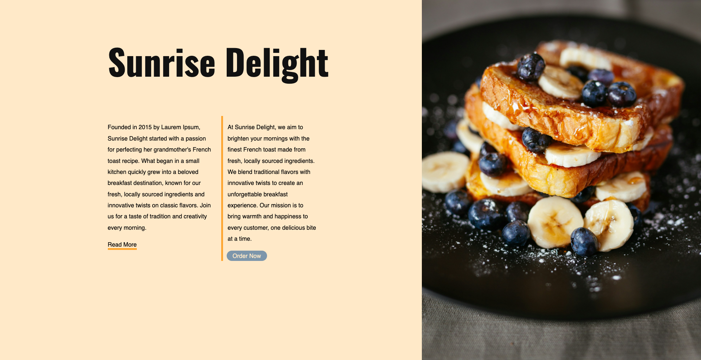
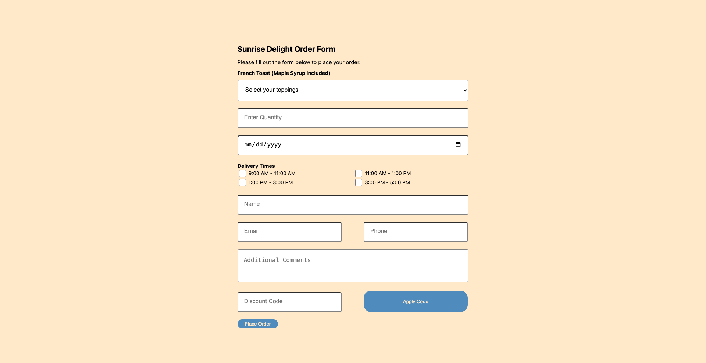

# Sunrise-Delight

Sunrise-Delight is a sample website for a restaurant's ordering system. The restaurant, Sunrise Delight, is famous for its French Toast, but they previously lacked an online ordering system. This project enables users to order from Sunrise Delight directly through the website.

## Features
- User data goes through validation; if validation fails, instructions are displayed on the form along with all the previously entered data.  
- **Ordering Form**: 
  - Accessible from the homepage.
  - Allows users to select:
    - Toppings
    - Quantity
    - Delivery date
    - Delivery time
- **User Information**:
  - Required: Full Name and phone number
  - Optional: Email, comments, and promotional code
- **Promotional Code**:
  - Users can apply a promotional code for discounts.
  - Integrated with a promo-code API built using the Django Rest Framework.
  - Promo-code API authenticates the existence of the promotional code and determines whether the user has previously applied that promotion (simulating a single-use promo code that one would receive.  
## Technologies Used

- **Front-end**: HTML, CSS, JavaScript
- **Back-end**: Python: Django, Django Rest Framework, DateTime library, Django Http: JsonResponse. 
- **Database**: PostgreSQL

## Website Preview
**Landing Page**

**Order Form**

